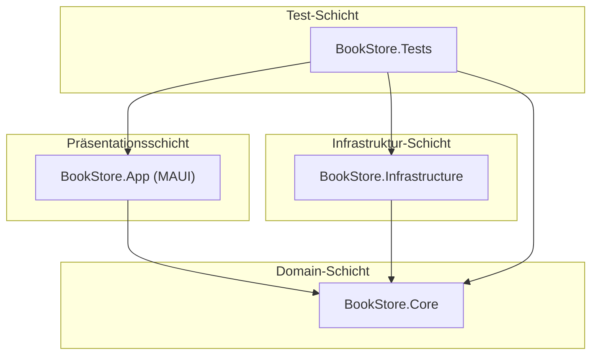

# Architektur-Übersicht

Dieses Dokument beschreibt die Software-Architektur der MAUI Bookstore Case Study.

## 1. Schichten (Layers)

Die Anwendung ist in drei Hauptprojekte unterteilt, um eine klare Trennung der Belange (Separation of Concerns) zu gewährleisten.

BookStore.Core: Enthält die "Business-Logik" und Definitionen.

Models: Reine POCOs (Plain Old C# Objects) wie Book und Author. Sie enthalten keine Logik.

Repositories/Services: Interfaces (z.B. IBookRepository), die definieren, was die Anwendung tun kann (z.B. GetBookByIdAsync).

BookStore.Infrastructure: Enthält die Implementierungen der Core-Interfaces.

Data: Für diese Case Study verwenden wir eine MockBookRepository, die eine statische In-Memory-Liste von Büchern verwaltet. In einem Real-World-Szenario wäre hier der EF Core DbContext oder ein API-Client.

BookStore.App: Das .NET MAUI-Projekt. Es enthält alles, was mit der UI zu tun hat.

Views: XAML-Dateien (die "View").

ViewModels: Die "Presentation-Ready ViewModels".

MauiProgram.cs: Konfiguration von DI, Fonts, etc.

BookStore.Tests: Unit-Tests, primär für die ViewModels in BookStore.App.

2. Das MVVM-Muster (Presentation-Ready)
Wir verfolgen einen strikten MVVM-Ansatz, der auf dem Humble Object Pattern basiert (auch bekannt als "Presentation-Ready ViewModels" oder "Testable ViewModels" im Stil von ViMoTest).

Das Problem (Standard-MVVM)

Ein typisches MVVM-ViewModel exponiert oft das gesamte Domain-Modell:

C#
// Standard-Ansatz (NICHT verwenden)
public class BookDetailViewModel : ObservableObject
{
    [ObservableProperty]
    private Book _currentBook; // <- Komplexes Domain-Modell
}
Nachteil: Die View (.xaml) muss komplexe Bindings verwenden ({Binding CurrentBook.Title}). Noch wichtiger: Um dieses ViewModel zu testen, muss der Test ein vollständiges Book-Objekt erstellen. Die UI-Logik (z.B. Formatierung) sickert oft in die View oder in Converter.

Unsere Lösung (Presentation-Ready VM)

Das ViewModel ist ein Adapter zwischen dem (komplexen) Domain-Modell und der (dummen) View. Es wandelt Modelldaten in primitive Anzeigedaten um.

C#
// Unser Ansatz (Presentation-Ready)
public class BookDetailViewModel : ObservableObject
{
    // Primitive, direkt bindbare Eigenschaften
    [ObservableProperty]
    private string _title;

    [ObservableProperty]
    private string _authorName;

    [ObservableProperty]
    private string _isbn;

    [ObservableProperty]
    private bool _isAvailable;

    [ObservableProperty]
    private string _availabilityText; // <- UI-Logik hier!
}
Interaktionsfluss

Code-Snippet
sequenceDiagram
    participant V as View (XAML)
    participant VM as ViewModel
    participant S as Service/Repo (z.B. IBookRepository)

    V->>VM: User klickt Button (Command)
    VM->>S: Ruft Logik auf (z.B. LoadBookAsync(id))
    S-->>VM: Gibt Domain-Modell zurück (Book-Objekt)

    Note right of VM: VM wandelt "Book" um!
    VM->>VM: _title = book.Title
    VM->>VM: _authorName = book.Author.Name
    VM->>VM: _isAvailable = book.Stock > 0
    VM->>VM: _availabilityText = book.Stock > 0 ? "Auf Lager" : "Vergriffen"

    VM-->>V: Update via INotifyPropertyChanged
    V->>V: Zeigt neue primitive Daten an
Vorteile dieses Ansatzes:

View ist "dumm": Die View bindet nur an Strings und Bools. Keine Converter, keine komplexe Logik im XAML.

ViewModel ist "super testbar": Ein Unit-Test muss nur das IBookRepository mocken. Der Test kann dann einfach Assert.Equal("Auf Lager", viewModel.AvailabilityText) prüfen. Wir müssen keine UI-Elemente oder komplexen Modell-Hierarchien im Test aufbauen.

3. Navigation
Wir verwenden die .NET MAUI Shell für die Hauptnavigation.

Ein FlyoutItem (Seitenleiste) dient als "Navigationsbaum" (z.B. "Bücher", "Autoren", "Einstellungen").

Der Hauptbereich (<ShellContent>) hostet die Master-Detail-Ansichten.

Navigation zwischen Seiten (z.B. von Liste zu Detail) erfolgt URI-basiert (Shell.Current.GoToAsync("BookDetailPage?id=123")).

ViewModels, die Daten empfangen, implementieren IQueryAttributable.