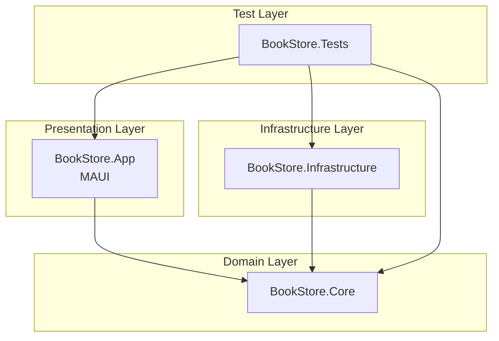
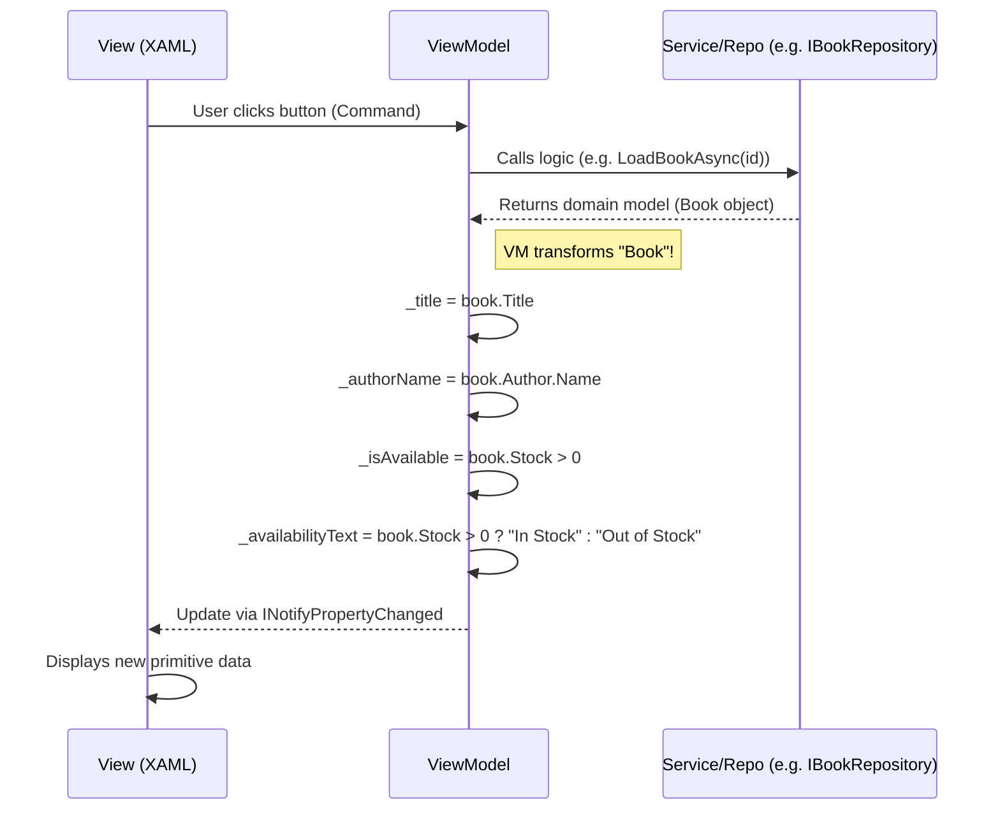

# Architecture Overview

This document describes the software architecture of the MAUI Bookstore Case Study.

## 1. Layers

The application is divided into three main projects to ensure a clear Separation of Concerns.



  * **`BookStore.Core`:** Contains the "business logic" and definitions.
      * **Models:** Pure POCOs (Plain Old C\# Objects) like `Book` and `Author`. They contain no logic.
      * **Repositories/Services:** Interfaces (e.g., `IBookRepository`) that define *what* the application can do (e.g., `GetBookByIdAsync`).
  * **`BookStore.Infrastructure`:** Contains the *implementations* of the Core interfaces.
      * **Data:** For this case study, we use a `MockBookRepository` that manages a static in-memory list of books. In a real-world scenario, this is where the EF Core `DbContext` or an API client would be.
  * **`BookStore.App`:** The .NET MAUI project. It contains everything related to the UI.
      * **Views:** XAML files (the "View").
      * **ViewModels:** The "Presentation-Ready ViewModels".
      * **`MauiProgram.cs`:** Configuration of DI, fonts, etc.
  * **`BookStore.Tests`:** Unit tests, primarily for the ViewModels in `BookStore.App`.

## 2\. The MVVM Pattern (Presentation-Ready)

[cite\_start]We follow a strict MVVM approach based on the **Humble Object Pattern** (also known as "Presentation-Ready ViewModels" or "Testable ViewModels" in the style of ViMoTest)[cite: 18, 292, 317].

### The Problem (Standard MVVM)

A typical MVVM ViewModel often exposes the entire domain model:

```csharp
// Standard approach (DO NOT use)
public class BookDetailViewModel : ObservableObject
{
    [ObservableProperty]
    private Book _currentBook; [cite_start]// <- Complex domain model [cite: 332]
}
```

  * **Disadvantage:** The View (`.xaml`) must use complex bindings (`{Binding CurrentBook.Title}`). [cite\_start]More importantly, to test this ViewModel, the test must create a complete `Book` object[cite: 314]. [cite\_start]UI logic (like formatting) often leaks into the View or into converters[cite: 313].

### Our Solution (Presentation-Ready VM)

[cite\_start]The ViewModel acts as an **adapter** between the (complex) domain model and the (dumb) View[cite: 318]. [cite\_start]It converts model data into primitive display data[cite: 319].

```csharp
// Our approach (Presentation-Ready)
public class BookDetailViewModel : ObservableObject
{
    // Primitive, directly bindable properties
    [ObservableProperty]
    private string _title;

    [ObservableProperty]
    private string _authorName;

    [ObservableProperty]
    private string _isbn;

    [ObservableProperty]
    private bool _isAvailable;

    [ObservableProperty]
    private string _availabilityText; [cite_start]// <- UI logic belongs here! [cite: 321]
}
```

### Interaction Flow



  * **Advantages of this approach:**
    1.  [cite\_start]**View is "dumb":** The View only binds to strings and bools[cite: 319]. No converters, no complex logic in XAML.
    2.  **ViewModel is "super testable":** A unit test only needs to mock the `IBookRepository`. [cite\_start]The test can then simply check `Assert.Equal("In Stock", viewModel.AvailabilityText)`[cite: 320]. We don't need to build UI elements or complex model hierarchies in the test.

## 3\. Navigation

We use the .NET MAUI Shell for main navigation.

  * A **FlyoutItem** (sidebar) serves as the "navigation tree" (e.g., "Books", "Authors", "Settings").
  * The main area (`<ShellContent>`) hosts the master-detail views.
  * Navigation between pages (e.g., from list to detail) is URI-based (`Shell.Current.GoToAsync("BookDetailPage?id=123")`).
  * ViewModels that receive data implement `IQueryAttributable`.

<!-- end list -->
